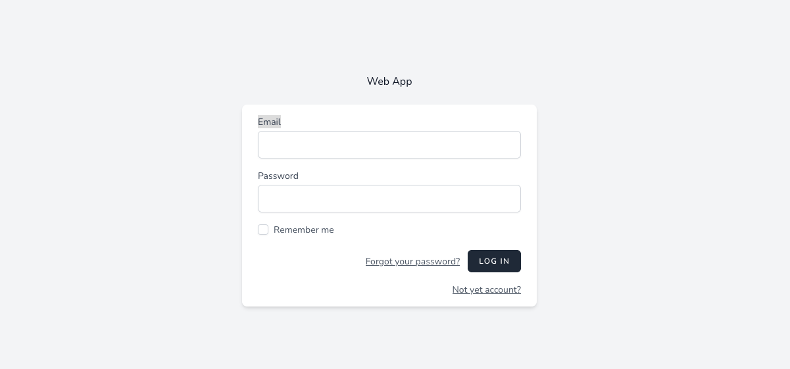

## About Laravel

Laravel is a web application framework with expressive, elegant syntax. We believe development must be an enjoyable and creative experience to be truly fulfilling. Laravel takes the pain out of development by easing common tasks used in many web projects, such as:

## License

The Laravel framework is open-sourced software licensed under the [MIT license](https://opensource.org/licenses/MIT).

## Setup User Authentication with breeze startkit in laravel

Breeze provides a minimal and simple starting point for building a Laravel application with authentication. Styled with Tailwind, Breeze publishes authentication controllers and views to your application that can be easily customized based on your own application's needs.

Laravel Breeze is powered by Blade and Tailwind.

## Web App Demo

